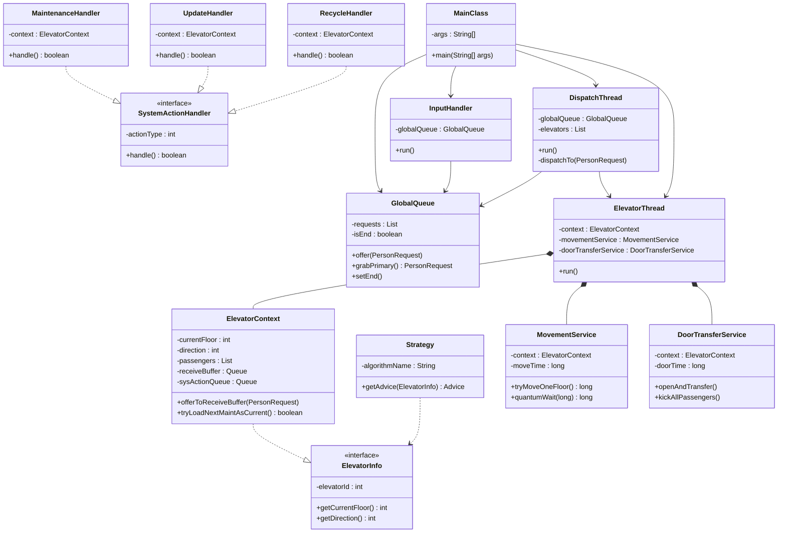

```mermaid
classDiagram
    %% 接口
    class SystemActionHandler {
        <<interface>>
        -actionType : int
        +handle() boolean
    }
    class ElevatorInfo {
        <<interface>>
        -elevatorId : int
        +getCurrentFloor() int
        +getDirection() int
    }
    
    %% 主控域
    class MainClass {
        -args : String[]
        +main(String[] args)
    }
    class InputHandler {
        -globalQueue : GlobalQueue
        +run()
    }
    class DispatchThread {
        -globalQueue : GlobalQueue
        -elevators : List
        +run()
        -dispatchTo(PersonRequest)
    }
    class GlobalQueue {
        -requests : List
        -isEnd : boolean
        +offer(PersonRequest)
        +grabPrimary() PersonRequest
        +setEnd()
    }

    %% 电梯实体与服务域
    class ElevatorThread {
        -context : ElevatorContext
        -movementService : MovementService
        -doorTransferService : DoorTransferService
        +run()
    }
    class ElevatorContext {
        -currentFloor : int
        -direction : int
        -passengers : List
        -receiveBuffer : Queue
        -sysActionQueue : Queue
        +offerToReceiveBuffer(PersonRequest)
        +tryLoadNextMaintAsCurrent() boolean
    }
    class Strategy {
        -algorithmName : String
        +getAdvice(ElevatorInfo) Advice
    }
    class MovementService {
        -context : ElevatorContext
        -moveTime : long
        +tryMoveOneFloor() long
        +quantumWait(long) long
    }
    class DoorTransferService {
        -context : ElevatorContext
        -doorTime : long
        +openAndTransfer()
        +kickAllPassengers()
    }
    
    %% 重构动作派生
    class MaintenanceHandler {
        -context : ElevatorContext
        +handle() boolean
    }
    class UpdateHandler {
        -context : ElevatorContext
        +handle() boolean
    }
    class RecycleHandler {
        -context : ElevatorContext
        +handle() boolean
    }

    %% 关联连线
    MainClass --> GlobalQueue
    MainClass --> InputHandler
    MainClass --> DispatchThread
    MainClass --> ElevatorThread
    InputHandler --> GlobalQueue
    DispatchThread --> GlobalQueue
    DispatchThread --> ElevatorThread
    ElevatorThread *-- ElevatorContext
    ElevatorThread *-- MovementService
    ElevatorThread *-- DoorTransferService
    ElevatorContext ..|> ElevatorInfo
    Strategy ..> ElevatorInfo
    MaintenanceHandler ..|> SystemActionHandler
    UpdateHandler ..|> SystemActionHandler
    RecycleHandler ..|> SystemActionHandler
```