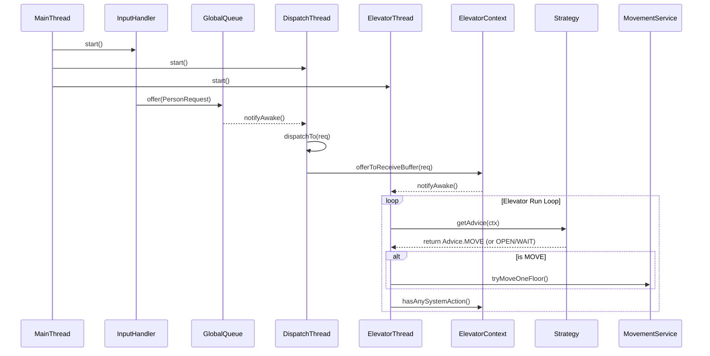

```mermaid
sequenceDiagram
    participant Main as MainThread
    participant Inp as InputHandler
    participant GQ as GlobalQueue
    participant Disp as DispatchThread
    participant ET as ElevatorThread
    participant Ctx as ElevatorContext
    participant Strat as Strategy
    participant Move as MovementService

    Main->>Inp: start()
    Main->>Disp: start()
    Main->>ET: start()
    
    Inp->>GQ: offer(PersonRequest)
    GQ-->>Disp: notifyAwake()
    Disp->>Disp: dispatchTo(req)
    Disp->>Ctx: offerToReceiveBuffer(req)
    Ctx-->>ET: notifyAwake()
    
    loop Elevator Run Loop
        ET->>Strat: getAdvice(ctx)
        Strat-->>ET: return Advice.MOVE (or OPEN/WAIT)
        alt is MOVE
            ET->>Move: tryMoveOneFloor()
        end
        ET->>Ctx: hasAnySystemAction()
    end
```